# Informe de Despliegue del Stack de Observabilidad en Kubernetes

## Objetivo

Migrar el stack de observabilidad (Grafana, Loki, Tempo y Prometheus) desde un entorno con Docker Compose a un clúster de Kubernetes usando Helm, sustituyendo Prometheus por **Grafana Mimir**.

## Arquitectura General

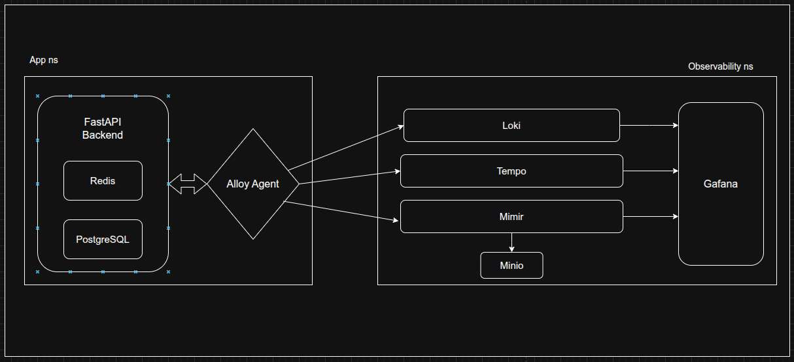


- **Namespace `app`**: backend + Alloy Agent
- **Namespace `observability`**: stack de observabilidad completo
- **Volúmenes**: logs montados desde el backend en `/app-logs/backend.log`

## Componentes Desplegados con Helm

| Componente | Chart Helm                  | Archivo `values` usado         | Notas                               |
|------------|-----------------------------|-------------------------------|-------------------------------------|
| Grafana    | grafana/grafana             | `values-grafana.yaml`         | Visualización de métricas, logs y trazas |
| Loki       | grafana/loki                | `values-loki.yaml`            | Logs estructurados desde FastAPI   |
| Tempo      | grafana/tempo-distributed   | `values-tempo.yaml`           | Recibe trazas vía OTLP             |
| Mimir      | grafana/mimir-distributed   | `values-mimir.yaml`           | Sustituye Prometheus como TSDB     |
| Alloy      | grafana/alloy               | `values-alloy.yaml`           | Agente unificado de observabilidad |

## Comandos Principales Ejecutados

```bash
kubectl create namespace observability
kubectl create namespace app

helm repo add grafana https://grafana.github.io/helm-charts
helm repo update

helm upgrade --install grafana grafana/grafana -n observability -f values-grafana.yaml
helm upgrade --install loki grafana/loki -n observability -f values-loki.yaml
helm upgrade --install tempo grafana/tempo-distributed -n observability -f values-tempo.yaml
helm upgrade --install mimir grafana/mimir-distributed -n observability -f values-mimir.yaml
helm install --namespace app alloy grafana/alloy
kubectl create cm -n app alloy-config "--from-file=configmap.alloy=../eu-kubernetes-workload-example/alloy/configmap.alloy"
helm upgrade --install alloy grafana/alloy -n app -f ../eu-kubernetes-workload-example/alloy/values-alloy.yaml
```
## Conexión

Alloy
 1. Instalar el Helm chart básico de Alloy

    `helm install --namespace app alloy grafana/alloy`

 2. Crear un ConfigMap personalizado para Alloy y reiniciar Alloy para que use el nuevo ConfigMap en lugar del predefinido:

    ```bash
    kubectl create cm -n app alloy-config "--from-file=configmap.alloy=../eu-kubernetes-workload-example/alloy/configmap.alloy"

    helm upgrade alloy grafana/alloy -n app -f ./eu-kubernetes-workload-example/alloy/values-alloy.yaml

    kubectl port-forward -n app svc/alloy 12345 &
    ```

    ```bash
    ## El ConfigMap de Alloy añade la URL de escritura para Mimir.
    prometheus.remote_write "default" {
    endpoint {
        url = "http://mimir-nginx.observability.svc.cluster.local/api/v1/push"
        headers = {
        "X-Scope-OrgID" = "demo",
        }
    }
    }
    ## Y el log path
    local.file_match "backend_logs" {
    path_targets = [
        { "__path__" = "/app-logs/backend.log" },
    ]
    }

    loki.write "default" {
    endpoint {
        url = "http://loki-gateway.observability.svc.cluster.local/loki/api/v1/push"
    }
    }

    ## Y tracing
    otelcol.exporter.otlp "tempo" {
    client {
        endpoint = "tempo.observability.svc.cluster.local:4317"
        tls {
        insecure = true
        }
    }
    }
    ```


## Validación

### Alloy 

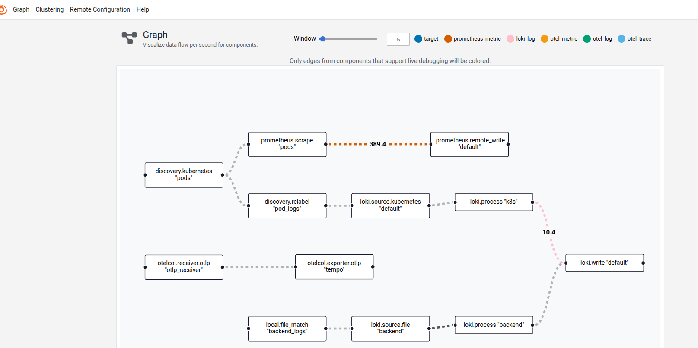
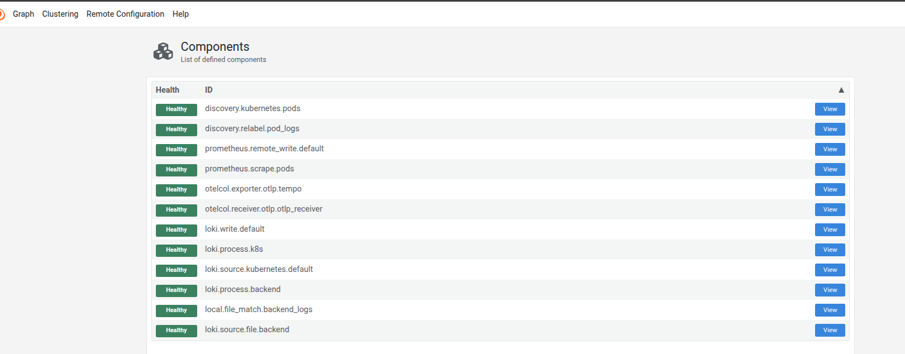
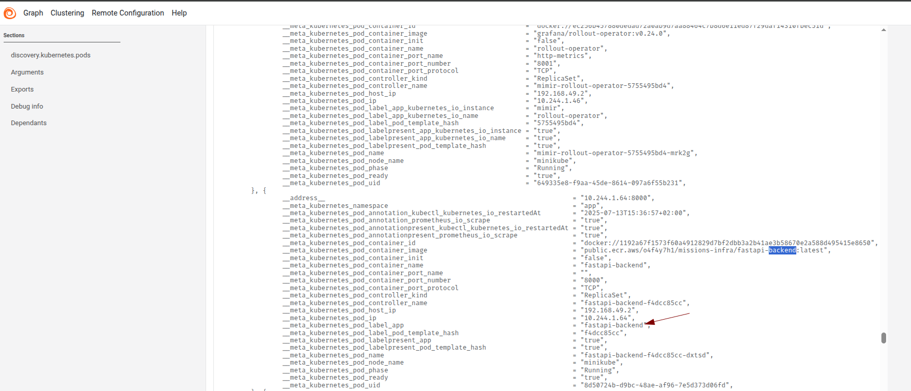


### Logs (Loki)
Probar Loki cuando está con port-forward: envío de logs a Loki con payload en formato JSON
Enviar logs a Loki al endpoint /loki/api/v1/push + verificación

    ```bash
    curl -H "Content-Type: application/json" -XPOST -s "http://127.0.0.1:3100/loki/api/v1/push"  \
    --data-raw '{"streams": [{"stream": {"job": "test"}, "values": [["'"$(date +%s)000000000"'", "hello world"]]}]}'


    {
    "streams": [ 
        { 
        "stream": { "job": "test" }, 
        "values": [
            ["<timestamp>", "hello world"]  
        ]
        }
    ]
    }
    
    curl "http://127.0.0.1:3100/loki/api/v1/query_range" --data-urlencode 'query={job="test"}' | jq .data.result

    ```


### Trazas (Tempo)

* Tempo recibe trazas por `4317` (gRPC OTLP).

    ```bash
    kubectl port-forward -n observability svc/tempo 3200:3200
    curl -i http://localhost:3200/ready
    ```

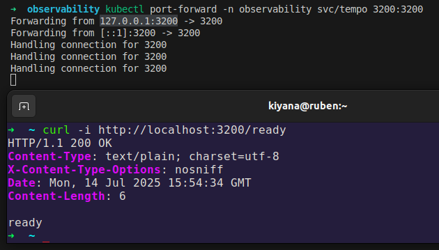


### Métricas (Mimir)

Confirma que todos los componentes de Minio estan activos y healthy.


```bash
    kubectl port-forward svc/mimir-distributor -n observability 8080:8080
```
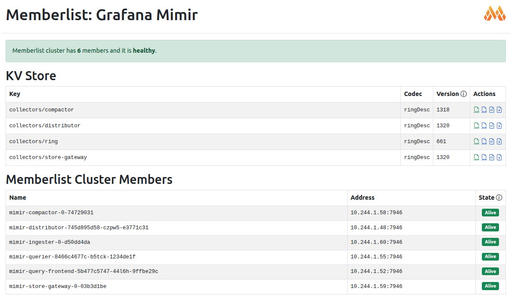


## Evidencias 

* kubectl get pods -A
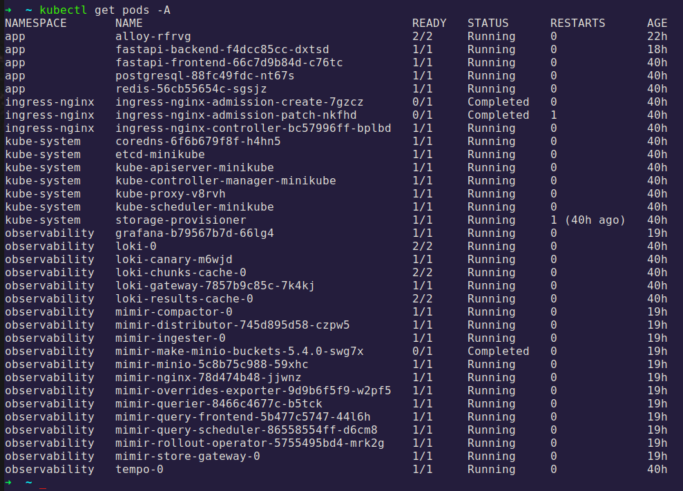
* Dashboards de Grafana (métricas, logs, trazas)
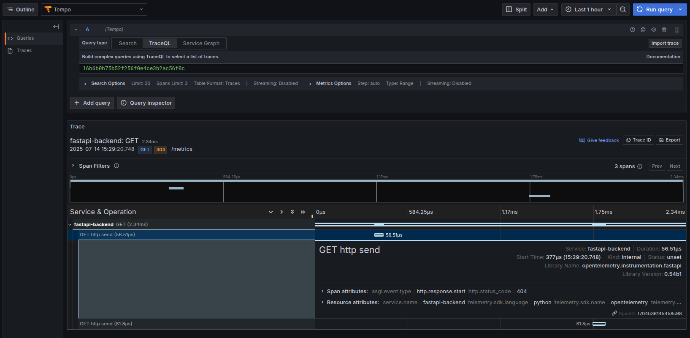
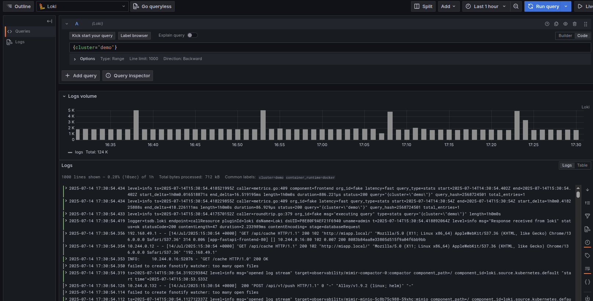
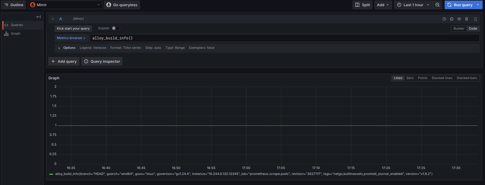
* Mimir funcionando como fuente de métricas
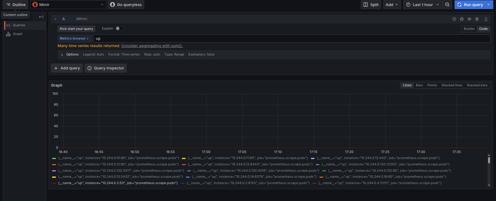


## Almacenamiento

* Mimir utiliza MinIO como backend en modo local.
* Se verificó el acceso con port-forward en `localhost:9001`.
* Credenciales configuradas en values-mimir.yaml:
    ```yaml
    minio:
    enabled: true
    rootUser: grafana-mimir
    rootPassword: supersecret
    policy: public
    ```
* Credenciales extraídas desde los secrets, si no se configura en values:
    ```bash
    kubectl get secret mimir-minio -n observability -o jsonpath="{.data.rootUser}" | base64 -d
    kubectl get secret mimir-minio -n observability -o jsonpath="{.data.rootPassword}" | base64 -d
    ```

