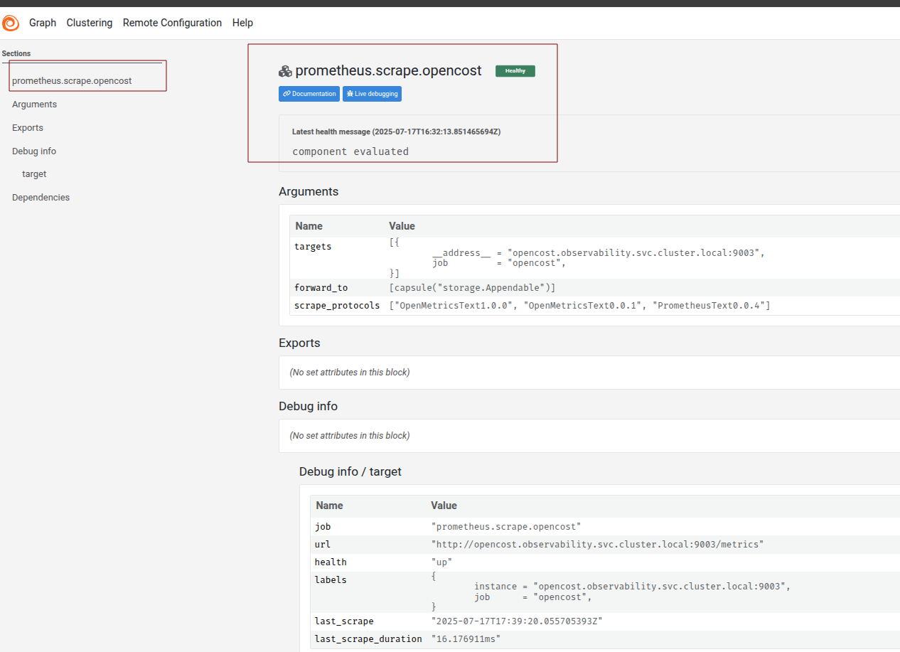
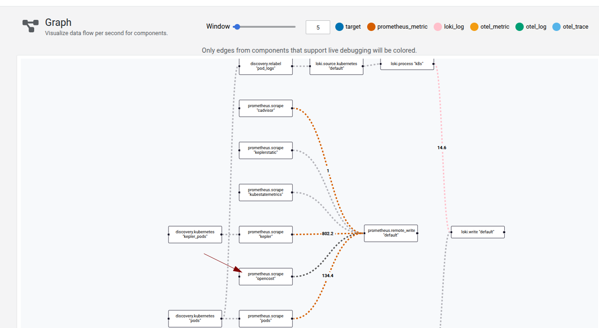
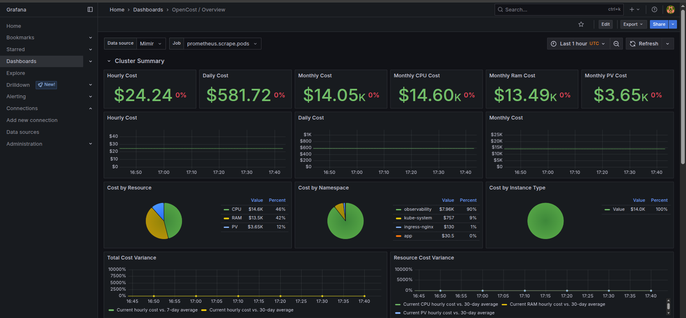
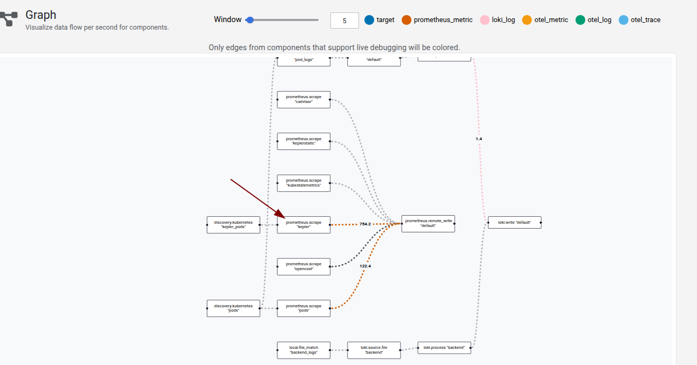
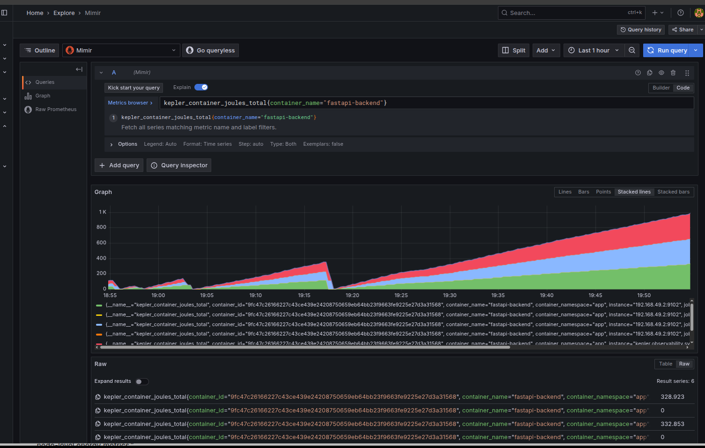

# Integración de OpenCost + Kepler

**OpenCost** es una herramienta de monitorización de costes para Kubernetes que obtiene métricas de uso de recursos (CPU, RAM) desde Prometheus o Mimir, y calcula los costes según precios unitarios configurables (definidos en el archivo de valores del Helm chart). Expone la API backend en el puerto `9003` y la interfaz de usuario en el puerto `9090`, permitiendo visualizar el desglose de costes por namespace, pod o contenedor.

---

### Pasos para desplegar OpenCost

1. Añadir el repositorio de Helm de OpenCost:

   ```bash
   helm repo add opencost https://opencost.github.io/opencost-helm-chart
   ```

2. Crear un archivo de valores personalizado como el siguiente:

   ```yaml
   env:
   - name: PROMETHEUS_SERVER_ENDPOINT
     value: http://mimir-query-frontend.observability.svc.cluster.local:8080/prometheus

   customPricing:
     enabled: true
     createConfigmap: true
     provider: custom
     costModel:
       CPU: 1.25
       RAM: 0.60

   prometheus:
     internal:
       enabled: false
     external:
       enabled: true
       url: http://mimir-query-frontend.observability.svc.cluster.local:8080/prometheus
   ```

3. Instalar el Helm chart de OpenCost usando el archivo de valores:

   ```bash
   helm upgrade opencost opencost/opencost --namespace observabilidad -f values-opencost.yaml
   ```

4. Verificar que el pod de OpenCost esté corriendo:

   ```bash
   kubectl get pods -n observability | grep open
   ```

5. Añadir el scrape de OpenCost al archivo de configuración de Alloy y crear el ConfigMap:

   ```bash
   # Configuración Alloy
   prometheus.scrape "opencost" {
     targets = [
       {
         __address__ = "opencost.observability.svc.cluster.local:9003", 
         job         = "opencost",
       },
     ]
     forward_to = [prometheus.remote_write.default.receiver]
   }

   # Crear el configmap
   kubectl create cm -n app alloy-config --from-file=configmap.alloy=../eu-kubernetes-workload-example/alloy/configm
   ```

6. Verifica en el servicio Alloy mediante port-forward que los datos de OpenCost se están exponiendo correctamente.

   
   

7. Importa el dashboard oficial de OpenCost en Grafana y visualiza las métricas:

   

---

## Kepler

**Kepler** (Kubernetes-based Efficient Power Level Exporter) estima el consumo energético y la huella de carbono de las cargas de trabajo en Kubernetes recolectando métricas del sistema basadas en **eBPF** (tiempo de CPU, IRQs, contadores de hardware) directamente del kernel. Expone [metricas](https://github.com/sustainable-computing-io/kepler/blob/main/docs/user/metrics.md) compatibles con Prometheus desde su exporter en el puerto `9102` y opcionalmente puede usar un servidor de modelos en el puerto `8100` para mejorar la precisión.

---

### Pasos para desplegar Kepler

1. Añadir el repositorio de Helm e instalar Kepler con un archivo de valores personalizado:

    ```bash
      helm repo add kepler https://sustainable-computing-io.github.io/  kepler-helm-chart/

      helm upgrade --install kepler kepler/kepler -n observability -f   values-kepler.yaml
    ```

2. Verificar que el pod de Kepler esté activo:

   ```bash
   kubectl get pods -A | grep kepler
   ```

3. Añadir el scrape de Kepler al archivo de configuración de Alloy y crear el ConfigMap actualizado:

   ```hcl
   discovery.kubernetes "kepler_pods" {
     role = "pod"
   }

   prometheus.scrape "kepler" {
     targets = discovery.kubernetes.kepler_pods.targets
     forward_to = [prometheus.remote_write.default.receiver]
   }

   prometheus.scrape "keplerstatic" {
     targets = [
       {
         __address__ = "kepler.observability.svc.cluster.local:9102",
         job         = "kepler",
       },
     ]
     forward_to = [prometheus.remote_write.default.receiver]
   }

   # Crear el configmap
   kubectl create cm -n app alloy-config --from-file=configmap.alloy=../eu-kubernetes-workload-example/alloy/configm
   ```

   

4. Visualizar las métricas de Kepler en Grafana:

   

